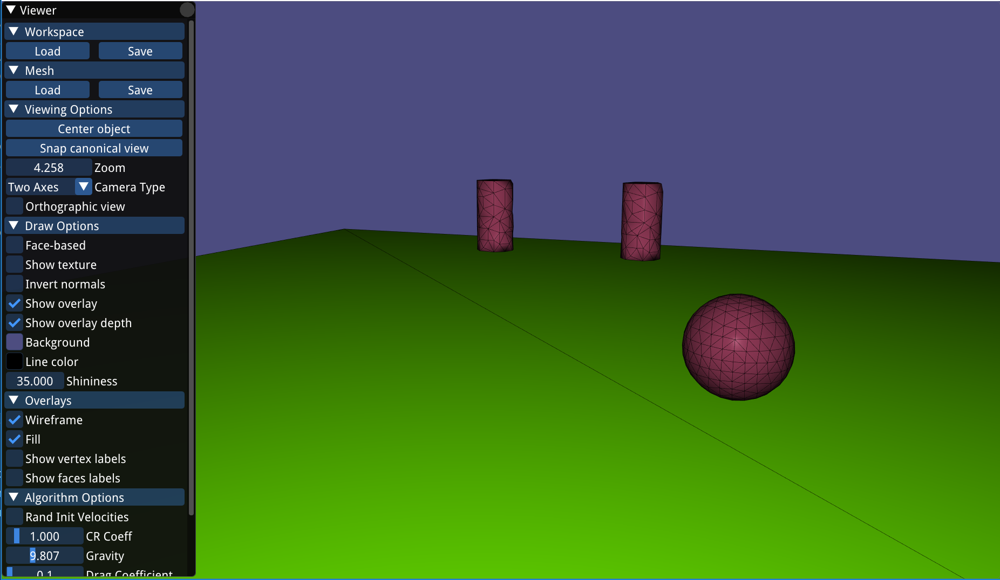

# Aerodynamics of Sports Balls 

The goal of this project is to investigate and simulate the aerodynamics of rotating uniform projectiles (balls) used in sports and study their trajectories by implementing numerical integration.




# Usage
The project is built upon the skeleton of the first practical.

The program is loaded by providing two commandline arguments: path of data folder (without final "/"), and name of TXT file that describes the scene, in this case "ballscene.txt".

```../data ballscene.txt
```

At runtime, press "k" to kick the ball with predefined velocities and press Space to simulate.


##Installation

The skeleton uses the following dependencies: [libigl](http://libigl.github.io/libigl/), and consequently [Eigen](http://eigen.tuxfamily.org/index.php?title=Main_Page), for the representation and viewing of geometry, and [libccd](https://github.com/danfis/libccd) for collision detection. libigl viewer is using [imGUI](https://github.com/ocornut/imgui) for the menu. Everything is bundled as either submodules, or just incorporated code within the environment, and you do not have to take care of any installation details. To get the library, use:

```bash
git clone --recursive https://github.com/stralucira/SportsBallSimulation.git
```

to compile the environment, go into the `practical1` folder and enter in a terminal (macOS/Linux):

```bash
mkdir build
cd build
cmake -DCMAKE_BUILD_TYPE=Release ../
make
```

In windows, you need to use [cmake-gui](https://cmake.org/runningcmake/). Pressing twice ``configure`` and then ``generate`` will generate a Visual Studio solution in which you can work. The active soution should be ``practical1_bin``. *Note*: it only seems to work in 64-bit mode. 32-bit mode might give alignment errors.


